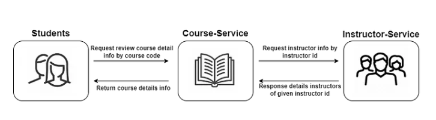

## CIRCUIT BREAKER PATTERN

### Instructor Service

### Course Service

#### Actuator

Actuator, Spring Boot uygulamalarının yönetimi ve izleme işlemlerini kolaylaştıran bir araçtır. Spring Boot Actuator, bir uygulamanın çalışma zamanında birçok farklı veriyi toplar ve bunları bir REST API aracılığıyla erişilebilir hale getirir. Bu veriler arasında uygulamanın performansı, sağlığı, depolama durumu ve çalışma zamanında değişen diğer özellikler gibi öğeler bulunur.

Health yerine farklı durumlarıda sorgulayabilirsiniz.
* autoconfig = Tüm autoconfig tanımlamalarını gösterir
* beans = Spring tarafından yönetilen tüm beanleri gösterir
* dump = Thread dump almayı sağlar.
* env = Spring’s ConfigurableEnvironment değerlerini gösterir.
* health = Uygulama sağlığını gösterir.
* info = Uygulama bilgilerini gösterir.
